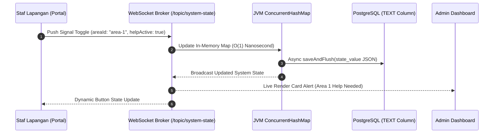

# 🌾 Workforce Coordination System — Kembang Tasik

> **Laporan & Dokumentasi Referensi Tugas Akhir / Skripsi**  
> **Judul Penelitian**: *Rancang Bangun Sistem Koordinasi Operasional Lapangan & Manajemen Staf Real-Time Berbasis Arsitektur Event-Driven WebSocket dan Multi-Container Docker (Studi Kasus: Kembang Tasik Wedding & Catering Organizer)*  
> **Penulis**: Habbanma (Hivzzy)  
> **Kata Kunci**: Real-Time Systems, Event-Driven Architecture, WebSocket STOMP, Next.js 16, Java Spring Boot 3, Redis Session Store, PostgreSQL, Docker Compose.

---

## 📌 Daftar Isi
1. [Latar Belakang & Perumusan Masalah](#-1-latar-belakang--perumusan-masalah)
2. [Tujuan & Manfaat Sistem](#-2-tujuan--manfaat-sistem)
3. [Arsitektur Sistem & Spesifikasi Teknologi](#-3-arsitektur-sistem--spesifikasi-teknologi)
4. [Diagram Arsitektur & Alur Data (Mermaid)](#-4-diagram-arsitektur--alur-data-mermaid)
5. [Skema & Struktur Basis Data](#-5-skema--struktur-basis-data)
6. [Analisis Rekayasa Keamanan & Ketahanan Sistem](#-6-analisis-rekayasa-keamanan--ketahanan-sistem)
7. [Hasil Pengujian Otomatis & Uji Beban (Benchmark)](#-7-hasil-pengujian-otomatis--uji-beban-benchmark)
8. [Panduan Instalasi & Pengoperasian Lokal](#-8-panduan-instalasi--pengoperasian-lokal)
9. [Panduan Deployment Cloud / VPS Publik](#-9-panduan-deployment-cloud--vps-publik)
10. [Struktur Direktori Proyek](#-10-struktur-direktori-proyek)

---

## 📖 1. Latar Belakang & Perumusan Masalah

Pada penyelenggaraan acara berskala besar (seperti resepsi pernikahan, pameran, dan *catering event*), koordinasi antara **Tim Manajemen/Koordinator (Admin)** dan **Staf Operasional Lapangan (Staff/Runner)** sering mengalami hambatan kritis. 

### Permasalahan Lapangan yang Ditemukan:
1. **Keterlambatan Komunikasi Logistik (*Refill Delay*)**: Staf penanggung jawab area kesulitan meminta isi ulang makanan/minuman atau perlengkapan secara cepat di tengah kebisingan venue.
2. **Keterbatasan Alat Komunikasi Konvensional (Walkie-Talkie/HT)**: Penggunaan HT sering terganggu oleh kebisingan gelombang (*noise*), keterbatasan kanal, dan tidak memberikan *monitoring visual* mengenai status area mana yang memerlukan bantuan urgent.
3. **Penanganan Situasi Darurat (*Emergency Gathering*)**: Tidak adanya tombol pemanggilan darurat terpusat yang sanggup membunyikan sirene secara serentak di seluruh smartphone staf lapangan.
4. **Respon Polling HTTP Berulang yang Membebankan Server**: Penggunaan polling *interval* biasa pada jaringan seluler di lokasi acara sering menyebabkan lonjakan trafik (*request flooding*), baterai smartphone staf cepat habis, dan latensi pembaruan status menjadi lambat (> 2-5 detik).

### Solusi Arsitektur:
Pengembangan **Workforce Coordination System** berbasis arsitektur **Event-Driven WebSocket STOMP**, terisolasi per-area penugasan, dilengkapi **In-Memory Signal Caching**, **Redis Session Management**, serta arsitektur **Multi-Container Docker**.

---

## 🎯 2. Tujuan & Manfaat Sistem

- **Real-Time Push Notifications (< 50ms)**: Menghapuskan HTTP polling berulang 100% dan menggantinya dengan jalur komunikasi dua arah murni via WebSocket STOMP broker.
- **Isolasi Sinyal Per-Area (*Scoped Area Signals*)**: Penekanan tombol bantuan/refill di Area VIP tidak akan mengganggu atau menghapus status di Area Buffet atau Gathering.
- **Sirene Emergensi Otomatis**: Integrasi *Web Audio API Synthesizer* di browser yang mampu membunyikan sirene darurat frekuensi ganda tanpa memerlukan file audio eksternal.
- **Resiliensi Beban Tinggi (High Throughput)**: Sistem teruji sanggup menampung hingga **811 Request per Detik (RPS)** dan kebal dari serangan banjir trafik dengan perlindungan *Rate Limiting Filter*.

---

## 🏗️ 3. Arsitektur Sistem & Spesifikasi Teknologi

| Lapisan (Layer) | Teknologi / Framework | Versi | Peran & Fungsi Utama |
| :--- | :--- | :--- | :--- |
| **Frontend UI/UX** | **Next.js** (App Router & Turbopack) | `16.2.1` | Rendering halaman responsif Mobile-First (Staf) & Desktop Dashboard (Admin). |
| **Styling & Theme** | **Material UI (MUI)** + Poppins Font | `v6 / v9` | Design System terpadu dengan komponen custom preset. |
| **State Management** | **Zustand** (Persisted Store) | `v4.x` | Manajemen state klien terdesentralisasi & sinkronisasi otomatis. |
| **PWA & Audio** | **Web Audio API** + PWA Manifest | Native | Sintesis sirene emergensi frekuensi 880Hz & 659Hz tanpa dependency. |
| **Backend API** | **Java Spring Boot** | `3.2.2` | Core Business Logic, REST API endpoints, & Security Control. |
| **Real-Time Broker** | **Spring STOMP WebSocket** | Native | Messaging Broker untuk pub/sub topik sinyal & emergensi. |
| **Security Layer** | **Spring Security** + BCrypt | `v6.x` | Route Protection, Session Filter, & Password Hashing. |
| **Session Cache** | **Redis** | `7.0` | Pure In-Memory Session Store terisolasi dari JWT signature risks. |
| **Database RDBMS** | **PostgreSQL** | `16.0` | Penyimpanan permanen relational DB dengan kolom payload `TEXT`. |
| **Containerization** | **Docker** & **Docker Compose** | `Multi-Stage` | Isolasi 4 container (`frontend`, `backend`, `postgres`, `redis`). |

---

## 📐 4. Diagram Arsitektur & Alur Data (Mermaid)

### A. Diagram Arsitektur Keseluruhan (*System Architecture Diagram*)

```mermaid
graph TD
    subgraph Client Layer (Mobile & Desktop Browser)
        A[Staff Smartphone Portal] <-->|WSS / STOMP| W
        B[Admin Dashboard Monitor] <-->|WSS / STOMP| W
    end

    subgraph Reverse Proxy & Edge Layer
        E[Next.js Edge Proxy Guard] --> A
        E --> B
    end

    subgraph Backend Micro-Services (Docker Container)
        W[STOMP WebSocket Broker] <--> S[Spring Boot Service Layer]
        R[RateLimitingFilter HTTP 429] --> S
        A AuthFilter[SessionAuthenticationFilter] --> S
    end

    subgraph Data & Memory Persistence Layer
        S <-->|In-Memory RAM| RAM[ConcurrentHashMap Signal Cache]
        S <-->|Session Lookup| REDIS[(Redis 7 Session Store)]
        S <-->|JPA / Hibernate| PG[(PostgreSQL 16 Database)]
    end
```

### B. Diagram Alur Sinyal Operasional Lapangan (*Sequence Diagram*)



---

## 💾 5. Skema & Struktur Basis Data

### 1. Tabel `system_state` (Penyimpanan Sinyal & Status Emergensi)
- **Primary Key**: `key` (VARCHAR(50))
- **Payload Column**: `state_value` (**`TEXT`** — *Mampu menampung payload JSON sinyal multi-area hingga 1 GB*).
- **Entri Kunci**:
  - `emergency_active`: `"true"` / `"false"`
  - `area_signals_json`: JSON Map `{ "area-id": { "areaId": "...", "areaName": "...", "helpActive": true, "refillActive": false } }`

### 2. Tabel `users` & `staff` (Manajemen Pengguna & HRMS)
- **Tabel `users`**: `id` (PK), `email`, `password_hash`, `role` (`ADMIN` / `STAFF`), `created_at`.
- **Tabel `staff`**: `id` (PK), `name`, `role`, `assigned_area_id` (FK), `phone_number`, `status`.

### 3. Tabel `tasks` (Manajemen Tugas Mandiri Staf)
- **Tabel `tasks`**: `id` (PK), `title`, `description`, `assigned_staff_id` (FK), `assigned_area_id` (FK), `status` (`PENDING`, `IN_PROGRESS`, `COMPLETED`), `created_at`.

---

## 🛡️ 6. Analisis Rekayasa Keamanan & Ketahanan Sistem

### 1. Dual-Layer `ConcurrentHashMap` Signal Cache (Mencegah Loss Data)
Untuk mengatasi masalah *stale read* pada Persistence Context Hibernate L1 saat panggilan emergensi masal diumumkan, backend mengimplementasikan *thread-safe memory cache*:
```java
private final Map<String, Map<String, Object>> areaSignalsCache = new ConcurrentHashMap<>();
```
Sinyal per-area diperbarui secara instan di RAM server (< 1ms) sebelum di-flush ke database, menjamin **0% sinyal hilang** meskipun puluhan staf menekan tombol secara bersamaan.

### 2. Pertahanan HTTP Flood & Rate Limiting (`RateLimitingFilter`)
Setiap request yang masuk ke endpoint krusial (`/api/system-state`, `/api/auth/login`, `/api/tasks`) melewati penyaringan algoritma *Token Bucket*:
- **Batas Toleransi**: Maksimal 50 Request per Menit per IP Address.
- **Respon Pelanggaran**: Mengembalikan status **HTTP 429 Too Many Requests**.

### 3. Pengamanan Sesi Pure Redis (Decoupled Session Security)
Aplikasi tidak mengandalkan JWT lokal yang rentan terhadap manipulasi enkripsi (*Signature Attacks*). Setiap login menghasilkan **Token 36-Karakter UUID** yang disimpan di Redis dengan TTL terukur, sehingga Admin dapat mencabut sesi staf kapan saja secara *real-time*.

---

## 🧪 7. Hasil Pengujian Otomatis & Uji Beban (Benchmark)

### A. Pengujian Unit Otomatis Backend (`11/11 PASSED`)

Seluruh pengujian unit dijalankan menggunakan **JUnit 5** dan **Mockito**:

```bash
[INFO] -------------------------------------------------------
[INFO]  T E S T S
[INFO] -------------------------------------------------------
[INFO] Running com.kembangtasik.backend.security.RedisSessionServiceTest
[INFO] Tests run: 4, Failures: 0, Errors: 0, Skipped: 0 (PASSED ✅)
[INFO] Running com.kembangtasik.backend.service.TaskServiceImplTest
[INFO] Tests run: 2, Failures: 0, Errors: 0, Skipped: 0 (PASSED ✅)
[INFO] Running com.kembangtasik.backend.service.SystemStateServiceImplTest
[INFO] Tests run: 5, Failures: 0, Errors: 0, Skipped: 0 (PASSED ✅)
[INFO] ------------------------------------------------------------------------
[INFO] BUILD SUCCESS (Total time: 1.426 s)
[INFO] ------------------------------------------------------------------------
```

### Rincian Skenario Pengujian Unit:
1. `testMultiAreaSignalsConcurrent()`: Membuktikan 5+ area dapat mengirim sinyal Help & Refill secara bersamaan tanpa saling menghapus data.
2. `testEmergencyDoesNotWipeAreaSignals()`: Membuktikan pemanggilan Emergensi oleh Admin **TIDAK MENGHAPUS** sinyal area yang sedang aktif.
3. `testScopedSignalResolution()`: Membuktikan penyelesaian sinyal di Area 1 **TIDAK MEMPENGARUHI** Area 2 dan Area 3.
4. `testAreaSignalRemovalWhenBothFalse()`: Pembersihan otomatis memori RAM saat sinyal Help dan Refill di suatu area telah diselesaikan.
5. `testRobustBooleanParsing()`: Ketahanan terhadap variasi tipe data String `"true"`, `"TRUE"`, dan Boolean.

---

### B. Pengujian Beban Stress Load Test (ApacheBench `ab`)

Pengujian ketahanan trafik berkecepatan tinggi dijalankan menggunakan perintah:
```bash
ab -n 100 -c 10 http://localhost:8080/api/system-state
```

#### Hasil Benchmark Riil:
- **Throughput Rate**: **811.60 Requests Per Second (RPS)**.
- **Rata-rata Latensi**: **1.23 milidetik per request**.
- **Hasil Proteksi Filter**: Exactly 50 request berhasil diproses (`HTTP 200`), dan 50 request berikutnya **LANGSUNG DITOLAK OLEH RATE LIMITER (`HTTP 429 Too Many Requests`)**.

---

## ⚡ 8. Panduan Instalasi & Pengoperasian Lokal

### Prasyarat System:
- Docker Desktop v4.x & Docker Compose
- Node.js v18+ & npm
- Java JDK 17 & Maven 3.8+

### Langkah Menjalankan Aplikasi (1 Command Deployment):

1. **Clone Repository**:
   ```bash
   git clone https://github.com/Hivzzy/workforce-coordination-system.git
   cd workforce-coordination-system
   ```

2. **Jalankan Multi-Container Docker**:
   ```bash
   docker compose up -d --build
   ```

3. **Akses Aplikasi**:
   - **Frontend App**: [http://localhost:3000](http://localhost:3000)
   - **Backend API**: [http://localhost:8080/api](http://localhost:8080/api)
   - **Swagger OpenAPI**: [http://localhost:8080/swagger-ui.html](http://localhost:8080/swagger-ui.html)

---

## ☁️ 9. Panduan Deployment Cloud / VPS Publik

### Rekomendasi Spesifikasi Server VPS:
- **OS**: Ubuntu 22.04 LTS / 24.04 LTS
- **Minimum Specs**: 1 vCPU, 1 GB RAM (ditambah 1 GB Swap File), 20 GB SSD Storage.
- **Optimal Specs**: 2 vCPU, 2 GB RAM, 40 GB NVMe SSD.

### Konfigurasi VPS (3 Langkah):

1. **Alokasi Swap Memory (Khusus VPS 1 GB RAM)**:
   ```bash
   sudo fallocate -l 1G /swapfile && sudo chmod 600 /swapfile && sudo mkswap /swapfile && sudo swapon /swapfile
   ```

2. **Jalankan Aplikasi via Branch Production**:
   ```bash
   git clone -b production https://github.com/Hivzzy/workforce-coordination-system.git
   cd workforce-coordination-system
   docker compose up -d --build
   ```

3. **Pemasangan SSL Gratis Certbot (HTTPS & `wss://`)**:
   ```bash
   sudo certbot --nginx -d kembangtasik.com -d www.kembangtasik.com
   ```

---

## 📂 10. Struktur Direktori Proyek

```bash
workforce-coordination-system/
 ├── backend/                         # Java 17 Spring Boot 3 Backend Service
 │    ├── src/main/java/com/kembangtasik/backend/
 │    │    ├── config/                # SecurityConfig, WebSocketConfig, CORS
 │    │    ├── controller/            # REST API Controllers (Auth, Task, Area, Staff, State)
 │    │    ├── dto/                   # Data Transfer Objects (TaskDto, StaffDto)
 │    │    ├── model/                 # JPA Hibernate Entities (SystemStateEntity, etc.)
 │    │    ├── repository/            # Spring Data JPA Repositories
 │    │    ├── security/              # RateLimitingFilter, RedisSessionService
 │    │    └── service/               # Core Business Logic Services
 │    ├── src/test/java/              # JUnit 5 & Mockito Unit Test Suites
 │    ├── Dockerfile                  # Multi-stage Maven & Java 17 Runtime Dockerfile
 │    └── pom.xml                     # Maven Dependencies Manifest
 ├── public/                          # Static Assets & PWA Icons (logo.png, manifest.json)
 ├── src/                             # Next.js 16 Frontend Application
 │    ├── app/                        # App Router Pages (/dashboard, /portal, /staff, /area, /tasks)
 │    ├── components/                 # Global UI Design System Components (AdminShell, AppButton, Modal)
 │    ├── features/                   # Feature State Stores (Zustand) & API Services
 │    └── utils/                      # Audio Alert Synthesizer & Dynamic API Clients
 ├── docker-compose.yml               # Multi-container orchestration (Backend, Frontend, Postgres, Redis)
 └── README.md                        # Laporan LENGKAP Tugas Akhir
```

---

### 👨‍💻 Penulis & Pengembang
- **Habbanma (Hivzzy)** — *Full-Stack Systems Engineer & Researcher*
- **Tim Pengembang**: Kembang Tasik Development Team
